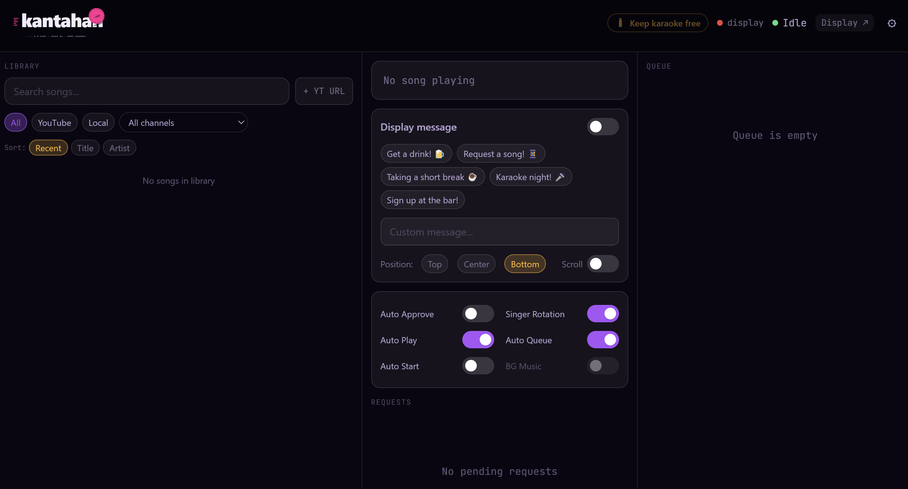
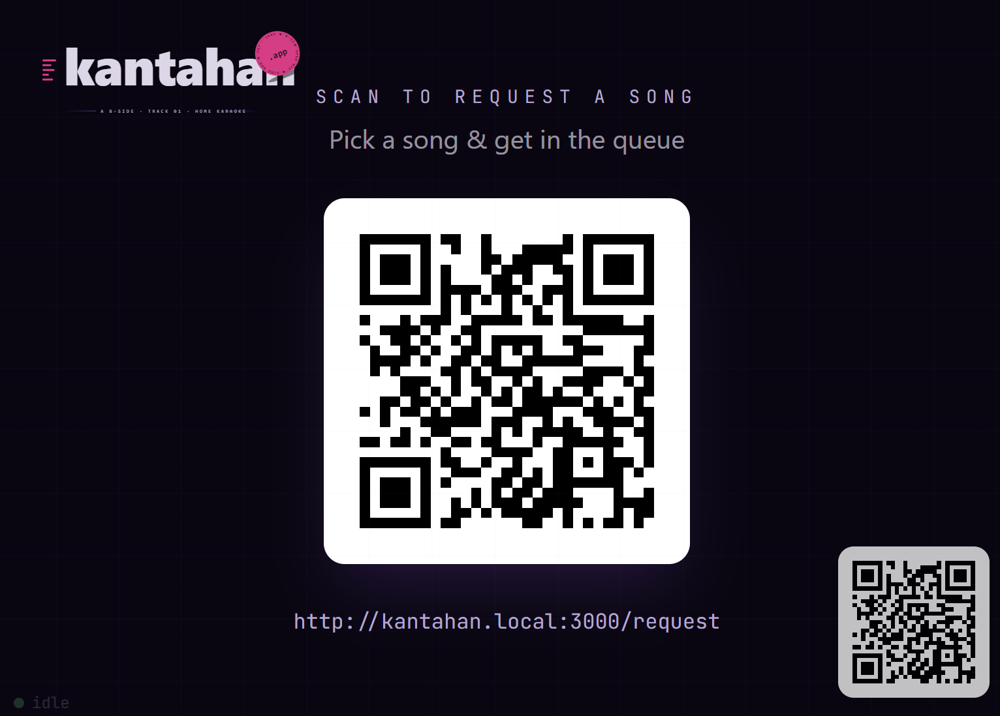
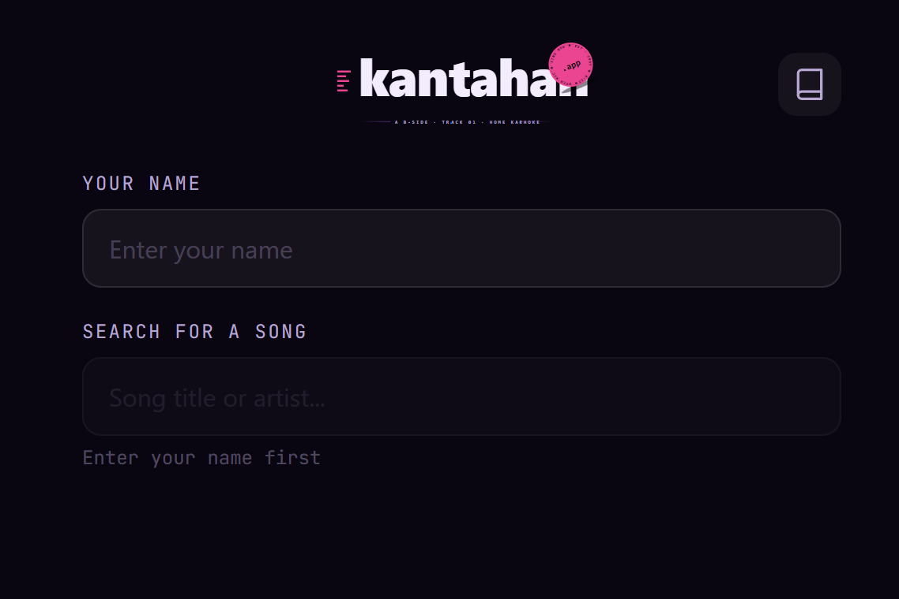
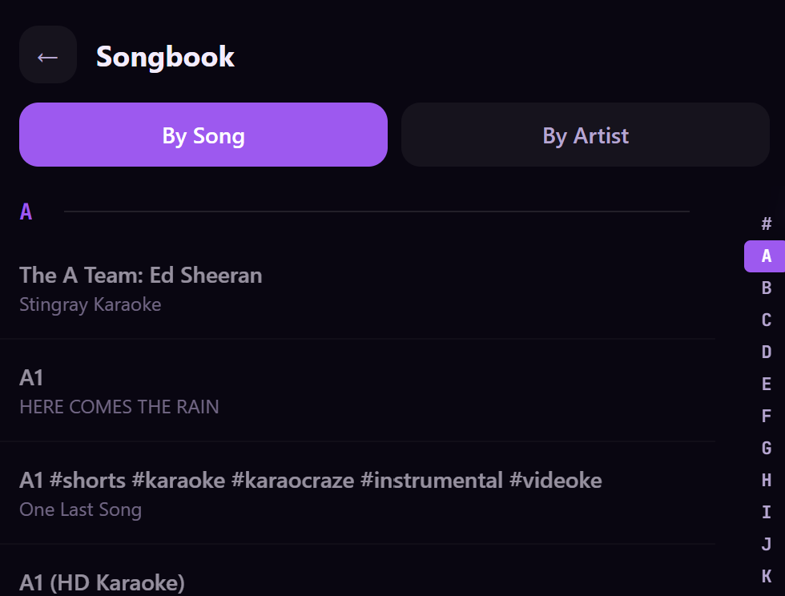

# Kantahan

[](https://ko-fi.com/stephancraane)

**Your own karaoke night, on your own terms.**

Kantahan (*Tagalog for "let's sing"*) is a self-hosted karaoke system that turns any TV, laptop, or projector into a karaoke stage — no subscription, no monthly fee, no proprietary hardware. Guests request songs from their phone, the DJ controls the show, and the music plays on the big screen.

---

## What it does

- **Massive song library** — Index your favourite YouTube karaoke channels and build a searchable library of thousands of songs instantly. Supports local files too (MP3+CDG, MKV, MP4).
- **Requests via QR code** — A QR code on the TV screen lets guests browse and request songs from their phone. No app download needed.
- **DJ control panel** — Approve or auto-approve requests, drag-reorder the queue, skip, pause, bump songs to the front, and set the countdown between singers — all from a browser tab.
- **Singer rotation** — Kantahan keeps the queue fair, cycling through singers so the same person can't hog the mic all night.
- **Background music** — Play a YouTube playlist or local tracks between songs to keep the vibe going during changeovers.
- **Display overlay** — The TV screen shows song title, singer name, countdown timer, and upcoming queue — so everyone knows what's next.
- **Configurable messages** — Scroll a custom message across the screen ("Get a drink! 🍺") between songs.

---

## How it works

Three screens, one server:

| Screen | Who uses it | How to open |
|---|---|---|
| **Display** | The TV / projector | Open the link on your TV browser, go fullscreen (F11 or double-click) |
| **DJ remote** | The person running the night | Open on any browser — laptop, tablet, phone |
| **Request**/**Songbook** | Your guests | Scan the QR code on the TV |

<table>
  <tr>
    <td></td>
    <td></td>
  </tr>
  <tr>
    <td></td>
    <td></td>
  </tr>
</table>

---

## Install

### Docker (recommended for always-on setups)

Works great on a home server, NAS, or Raspberry Pi 5. Run it once and leave it running.

```bash
# 1. Clone and build the frontend
git clone https://github.com/nexed-tech/kantahan.git
cd kantahan
npm install
npm run build

# 2. Start the server
docker compose up -d
```

The app is now running at **http://your-server-ip:3000**.

- The DJ panel is at `/dj`
- The display screen is at `/display`
- The request screen is at `/request`

Data (database, settings) is stored in `./data` so it survives container restarts.

To keep local media files accessible, set `MEDIA_PATH` to your music folder:

```bash
MEDIA_PATH=/path/to/your/music docker compose up -d
```

---

### Windows (Desktop app)

Runs as a standalone desktop app — no browser, no server setup, no command line needed after install.

**Option A — Install from release**
Download the `.exe` installer from the [Releases](../../releases) page and run it. That's it.

**Option B — Run from source**

```bash
# Requires Node.js 20+
git clone https://github.com/nexed-tech/kantahan.git
cd kantahan
npm install
npm run build
npm start
```

The app launches as a desktop window. The DJ panel, display screen, and request URL are all accessible from the tray icon.

---

### macOS *(not tested)*

```bash
git clone https://github.com/nexed-tech/kantahan.git
cd kantahan
npm install
npm run build
npm start
```

Or build a distributable:

```bash
npm run pack:mac
# Output: release/Kantahan-*.dmg
```

---

### Linux *(not tested)*

```bash
git clone https://github.com/nexed-tech/kantahan.git
cd kantahan
npm install
npm run build
npm start
```

Or build an AppImage:

```bash
npm run pack:linux
# Output: release/Kantahan-*.AppImage
```

For a headless/server install without Electron, Docker is the better choice.

---

## First-time setup

1. **Add a YouTube API key** — Open the DJ panel → Settings → YouTube → paste your [YouTube Data API v3 key](https://console.cloud.google.com/apis/library/youtube.googleapis.com). Free quota is more than enough for personal use.
2. **Index your channels** — A few popular karaoke channels are pre-loaded. Hit **Re-index all** and Kantahan will scan them and build your library. This takes a few minutes the first time.
3. **Open the display screen** — Click **Display ↗** in the DJ panel header to open the TV screen in a new window. Press F11 or double-click to go fullscreen.
4. **Share the request link** — Guests scan the QR on the TV screen (or you share the `/request` URL) and start putting in their songs.

---

## Development

```bash
npm install
npm run dev
```

Starts four processes in parallel:

- Express server → `http://localhost:3000`
- Display screen → `http://localhost:3001`
- DJ remote → `http://localhost:3002`
- Request screen → `http://localhost:3003`

---

## Support

If Kantahan saves you money on a KTV bill, consider buying the DJ a round:

[](https://ko-fi.com/stephancraane)
